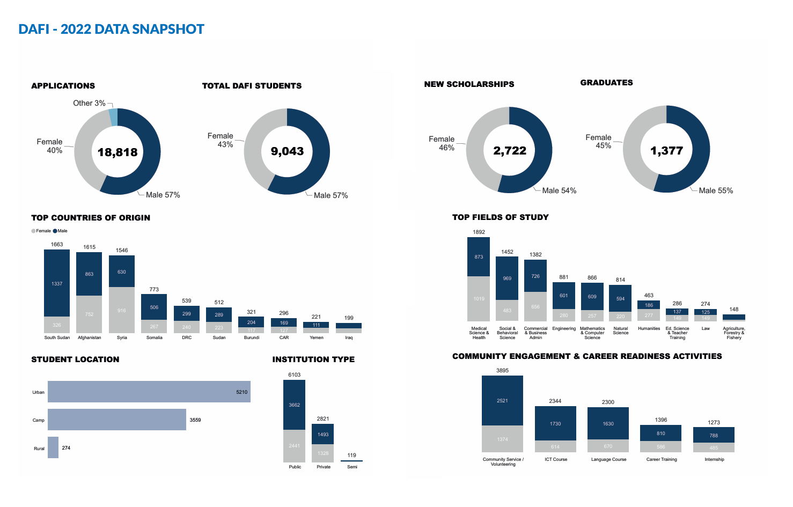

# 📚 Articles: AI, Education Access & Support Systems for Refugees

This document compiles key articles and institutional reports examining how
**artificial intelligence, data-driven systems, and digital platforms** can
support **refugee education, skills development, and long-term integration**.
These sources inform our ELO2 project on **improving higher-education access and
outcomes for refugees**.

---

## 📝 Article List

### 1. **Regional Strategic Dialogue on Refugees & Stateless Persons**

- **Source:** Asia Pacific Refugee Rights Network (APRRN)
- **Summary:**
  A regional policy dialogue addressing systemic barriers faced by refugees and
  stateless persons, including **education access, documentation, and long-term
  inclusion**. Highlights the need for coordinated, data-informed strategies
  across governments and NGOs.
- **Format:** Policy Report (PDF)
- **[Read Article](https://aprrn.org/media/Publications/files/Summary-Report_Regional_Strategic_Dialogue_on_Refugee_and_Stateless_C_XQtqK1F.pdf)**

---

### 2. **How Kiron Meets Refugees’ Needs**

- **Source:** Kiron Open Higher Education (Kiron.ngo)
- **Summary:**
  Explores Kiron’s digital-first education model that provides **online higher
  education pathways** for refugees lacking formal documentation. Emphasizes
  flexible credentials, partnerships, and learner-centered support.
- **Format:** Web Article
- **[Read Article](https://www.kiron.ngo/post/how-kiron-meets-refugees-needs-highlighted-in-latest-unhcr-report)**

---

### 3. **How AI Could Ease the Refugee Crisis and Bring New Talent to Businesses**

- **Source:** Harvard Business School – Working Knowledge
- **Summary:**
  Discusses how **AI-driven tools** can match refugees to education, training,
  and employment opportunities. Highlights AI’s potential in **credential
  recognition, skill mapping, and workforce integration**.
- **Format:** Web Article
- **[Read Article](https://www.library.hbs.edu/working-knowledge/how-ai-could-ease-the-refugee-crisis-and-bring-new-talent-to-businesses)**

---

### 4. **Using Machine Learning to Help Refugees Succeed**

- **Source:** Stanford Institute for Human-Centered Artificial Intelligence (HAI)
- **Summary:**
  Examines how **machine learning models** can predict educational success,
  personalize learning pathways, and improve outcomes for refugees in education
  and resettlement programs.
- **Format:** News / Research Article
- **[Read Article](https://hai.stanford.edu/news/using-machine-learning-help-refugees-succeed)**

---

### 📷 Related Visuals

<!-- markdownlint-disable MD033 -->

  

<!-- markdownlint-enable MD033 -->

### 5. **UNHCR – Higher Education and Skills**

- **Source:** United Nations High Commissioner for Refugees (UNHCR)
- **Summary:**
  Outlines UNHCR’s strategy for expanding **higher education access, digital
  skills, and employability** for refugees worldwide, emphasizing partnerships,
  technology, and data-driven planning.
- **Format:** Institutional Web Page
- **[Read Article](https://www.unhcr.org/what-we-do/build-better-futures/education/higher-education-and-skills)**

---

### 6. **UNHCR – 15by30 Higher-Education Roadmap**

- **Source:** UNHCR
- **Summary:**
  A strategic roadmap aiming to increase refugee participation in higher
  education to **15% by 2030**. Identifies systemic challenges, policy actions,
  and the role of **digital systems and data** in monitoring progress.
- **Format:** Strategy Report (PDF) – 2023
- **[Read Article](https://www.unhcr.org/sites/default/files/2023-12/15by30-roadmap.pdf)**

---

## 🔍 Relevance to Our Project

These sources collectively support:
- The need for **alternative, tech-enabled education pathways**
- The role of **AI and data** in predicting success and improving access
- The importance of **institutional strategies (UNHCR, NGOs)** aligned with
  digital innovation
- Evidence-based justification for **AI-assisted refugee education systems**
